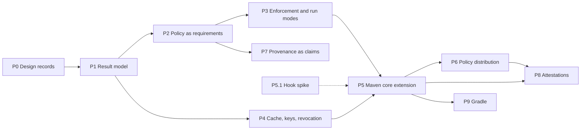

# Sigmund: Verification Roadmap

Status: living document. Updated in the same change that moves a task.

This is the working reference for evolving Sigmund's verification API and
implementation toward the [design direction](sigmund-verification-design-direction.md).
The three documents have distinct jobs:

| Document | Answers | Changes when |
|---|---|---|
| [Design direction](sigmund-verification-design-direction.md) | What and why | The design changes |
| This roadmap | In what order, and where we are | A task starts, finishes, splits, or is added |
| ADRs under [`adr/`](../adr) | What was decided, and the alternatives rejected | A decision is taken |

References such as §3.5 point to sections of the design direction.

---

## Working rules

- **No backward compatibility.** Sigmund has not been adopted. Types, config
  sections, plugin parameters and CLI options are replaced outright — no
  migration code, deprecated aliases or legacy schema readers.
- **Every phase ends in something demonstrable.** A phase is not done until its
  demo runs.
- **Every task ships with tests and docs.** Unit tests for all changes;
  integration tests where a task changes observable plugin or CLI behaviour.
  Affected pages under `docs/` and `AGENTS.md` are updated in the same change.
- **Task IDs are stable.** New tasks are appended to a phase with the next free
  number; tasks are never renumbered. A task that splits keeps its ID with a
  letter suffix (`P1.5a`, `P1.5b`).
- **Decisions go to ADRs, not here.** When a task settles something the design
  direction leaves open, record it as an ADR and link it from the decision log
  below.

Status values: `todo`, `in progress`, `done`, `blocked` (with the blocking
question linked), `dropped` (with a one-line reason).

---

## Baseline

Where the code stands against the design direction at the start of this
roadmap. Kept so that task descriptions can be read without re-deriving it.

| Area | Current state | Direction |
|---|---|---|
| Claim vocabulary | `VerificationUnit` sealed over `OpenPgpVerificationUnit`, `SigstoreVerificationUnit` | `Claim` (§3.1) |
| Artifact-level verdict | `TrustVerdict`: `TRUSTED`, `UNTRUSTED`, `UNSIGNED`, `NOT_CONFIGURED`, `VERIFICATION_FAILED` | Six outcomes (§3.5) |
| Tool-level verdict | `Verdict`: `PASS`, `FAIL`, `NO_KEY`, `SKIPPED` | Verified, `FAILED`, `INDETERMINATE` with reason |
| Failure mapping | Malformed Sigstore bundle → `FAIL`; Sigstore infrastructure failure → exception; unsupported OpenPGP algorithm → `SKIPPED`, which makes hybrid `.asc` `UNTRUSTED` under `listed-evidence: all` without `sq` | Attack signal and infrastructure problems never collapse (§3.5, §3.2.1) |
| Result | `TrustResult`: identity, verdict, matched and unmatched evidence | Claim, artifact and run results (§3.2) |
| Subject | `ArtifactIdentity`: namespace, name, version — no classifier, extension or digest | GAV + classifier/extension + digest; purl projection (§3.2, §8) |
| Time | Not extracted | Claim time, verification time, evaluation basis (§3.4) |
| Policy | `trust` maps patterns to expected signers; `signature-optional`; `policy.on-untrusted`, `listed-evidence`, `unlisted-evidence` | Role-scoped requirements; per-outcome, per-scope enforcement (§3.2, §3.3, §3.6) |
| Arguments | `sigmund.onUntrusted` and `sigmund.listedEvidence` override policy | Arguments configure how, never what (§5.3) |
| Config location | Plugin default `${project.basedir}/sigmund.yaml`; `ConfigLoader` checks base dir, then `~/.config/sigmund` | One policy at the reactor root (§5.1) |
| Orchestration | Reporting, enforcement and the `signature-optional` pre-filter live in `VerifyMojo` | In core, shared by every insertion point (§2) |
| Insertion points | `verify` and `dependency-signers` goals, bound to `validate`, resolving project dependencies only | Goal and core extension with identical results (§2) |
| Caching | `KeyFetchCache` in memory per session; no result cache | Persistent result cache in the trust model (§3.7) |
| Revocation | Not handled | Reason-code aware (§3.8) |
| Discovery | Sidecar lookup inside `ArtifactFileResolver` | `ProvenanceSource` SPI (§4) |
| Gradle | Plugin on commit `54f0705`, not on `main` | Gradle backend or metadata interop (§2.2) |

---

## Phases

The hook spike (P5.1) depends on nothing and can run at any time; its answer
shapes P5 and is a question for the Maven maintainers (§9). P7 needs only P1
and P2, so it can move earlier if provenance demand appears. P4 can run in
parallel with P2 and P3 once P1.9 is done.

### P0 — Design records

Settle the decisions everything else is built on.

| ID | Task | Refs | Depends | Status |
|---|---|---|---|---|
| P0.1 | Check `Claim` for ambiguity against sigstore-java and OIDC/JWT types on the classpath; choose `Claim` or `VerifiableClaim` | §3.1 | — | done — no class on the 52-jar compile classpath contains "Claim"; the name is `Claim` |
| P0.2 | ADR: result model — claim, artifact and run levels; roll-up rules; claim-set modes | §3.2, §3.2.1, §3.5 | — | done — [ADR-005](../adr/005-verification-result-model.md) |
| P0.3 | ADR: policy schema — role-scoped requirements, claim-set mode, per-outcome and per-target enforcement (`signature-optional` becomes per-target `NO_CLAIM` enforcement), matched-rule location | §3.2, §3.3, §3.6 | P0.2, P0.4 | done — [ADR-007](../adr/007-policy-schema-and-enforcement.md) |
| P0.4 | ADR: identity and credential model — key material versus attested identity, trusted issuers, subject expansion, key-material provenance | §3.3, §3.8, §5.3 | P0.2 | done — [ADR-006](../adr/006-identity-and-credential-model.md) |

### P1 — Vocabulary and result model

Establish the result model while the SPI is not public. Validated against the
two claim shapes already shipping — detached `.asc` and Sigstore bundles.

| ID | Task | Refs | Depends | Status |
|---|---|---|---|---|
| P1.1 | Rename `VerificationUnit` and its permits to the claim vocabulary; `SignatureFormat.parse` returns claims; update `AGENTS.md` and architecture docs | §3.1 | P0.1 | done — 30 files; 570 tests pass |
| P1.2 | Subject: classifier, extension and digest on the artifact identity; algorithm-tagged digest type (SHA-256 required) shared by subject, evidence and policy digests; one-way purl projection; policy matching stays at GAV level | §3.2, §8 | — | done — `DigestSet` and `ArtifactSubject` replace `ArtifactIdentity`; digest wiring from file bytes lands with P1.6 |
| P1.3 | Tool results carry claim outcome and reason: `NO_KEY` → `key-unavailable`, unsupported algorithm → `unsupported-algorithm`, malformed evidence → `evidence-malformed` (Sigstore bundle parse currently `FAIL`), Sigstore trust-root failure → `trust-root-unavailable` (currently thrown) | §3.5 | P1.1 | done — `Verdict` replaced by `ClaimOutcome` + `IndeterminateReason`; `TOOL_UNAVAILABLE` added to the reason set |
| P1.4 | Temporal fields: OpenPGP signature creation time and Sigstore integrated time as claim time, with evaluation basis per claim kind; verification time. Key expiry checked against claim time consistently across BC, `sq` and `gpg` (BC does not check expiry today) | §1.1, §3.4, §3.8 | P1.1 | done — claim time and `EvaluationBasis` live on the `Claim`; BC checks validity at claim time; verification time lands with the result model in P1.6 |
| P1.5 | Attester identity, trust root and evidence reference (file digest, source fixed to sidecar until P7) on the claim result | §3.2, §4 | P1.1 | done — `EvidenceRef` and `TrustRootRef` added, `SignatureTool.trustRoot()` reports the root per tool, both carried on `EvidenceResult` until P1.6 folds them into `ClaimResult`; attester credentials were already there |
| P1.6 | `Outcome` and `IndeterminateReason` types; claim, artifact and run result types replacing `TrustResult`, `TrustVerdict` and `Verdict` | §3.2, §3.5 | P0.2, P1.2–P1.5 | done — `Outcome`, `AttesterRole`, `ClaimSetMode`, `ClaimResult`, `ArtifactResult`, `RequirementEvaluator`, `OutcomeRollup`. Run-level types deferred to the phases that populate them: `Coverage`/`InsertionPoint`/`EnforcementMode` with P3.6, `PolicyRef` with P4.2, `CacheInfo` with P4.3. `ClaimKind` dropped — the claim kind is the format name, which config already uses |
| P1.7 | `TrustVerifier` derives artifact outcomes by the roll-up rules; claim-set mode replaces `listed-evidence` in the verifier | §3.2.1 | P1.6 | done — `TrustResult`, `TrustVerdict`, `MatchedEvidence` and `EvidenceResult` deleted; providers yield `ClaimResult`s; matching moved to `TrustPolicy.requirements()`; `VerifyMojo` reporting reduced pending P1.8/P1.9 |
| P1.8 | Move reporting, the pass/fail decision and the `signature-optional` pre-filter from `VerifyMojo` into core, behind an API with no build-tool types — repository concepts (coordinates, layout, sidecar conventions) allowed; Maven plugin API, project model and resolver session not | §2, §7 | P1.7 | done — `VerificationReport` in core owns grouping, counts, per-result description and the blocking decision; the `signature-optional` pre-filter is deleted rather than moved, so a tolerated artifact is still verified and a broken signature on it still blocks |
| P1.9 | Result model rendering: human report in core; `VerifyMojo` and CLI `verify-signature` switched to it | §3.2 | P1.8 | done — `ReportVerdict` retired in favour of counts by claim outcome, `summary()` renders them. `DependencySignersMojo` moved to P2.8: it consumes no `ArtifactResult`, grouping by signer profile for bootstrap, and P2.8 rewrites that rendering for the new schema |
| P1.10 | Parsed `ArtifactPattern` replacing raw pattern strings: arity and shape validated once at load, specificity carried by the pattern, classifier-scoped patterns rejected instead of silently matching nothing | §3.2 | — | done — pulled forward from P2.6 |
| P1.13 | Single-read `Evidence`: an evidence file is read once and digested from those bytes, then detection, parsing and the recorded reference all work from that read — closing the window where the digest describes different bytes than the claims came from | §3.2, §4 | P1.5 | done |
| P1.11 | Backend agreement interop test: the same claim through BC, `sq` and `gpg` yields the same outcome and reason | §1.1, §3.4, §3.5 | P1.6 | done — found a real defect: BC's ECDSA fallback generated keys with no key flags, which Sequoia rejects as "not signing capable" while GnuPG and BC accept them. Expiry-at-claim-time coverage still outstanding: generating an expired key in a test is awkward |
| P1.12 | API-surface audit of the three backends once integrations settle: every public type, constructor and member in core justified by a caller outside the package, or narrowed. Factories stay the construction path | §2, §7 | P1.9 | done — core went from 83 public types to 74. Narrowed: `CliTool`, `AscCombiner` with `OpenPgpSignaturePacketInfo`, `SignatureEvidenceAdapter`, `ArtifactPatternMatcher`, `KeyValidity`, `DefaultTrustPolicy`, `OutcomeRollup`, and the `BcRunner`/`GpgRunner` classes, whose factories were already package-private. `ArtifactResult.of(subject, rollup, …)` was dropped, since it was the only thing publishing `OutcomeRollup.Result` and `TrustVerifier` can build the record directly. `SqRunner` stays public: the CLI constructs it for keygen and cert export, which the `SignatureTool` SPI does not cover. `OpenPgpSignatureFormat` stays public with no caller outside core, because ADR-002 has third-party OpenPGP tools returning it from `signatureTool.signatureFormat()`. The 19 remaining types with no external caller are record components or return types of public API (`ArtifactSubject`, `ClaimResult`, `AttesterRole`, the config records, `RequirementEvaluator` via `TrustPolicy.requirements()`) or optional-capability SPIs (`SignerIdentityResolver`, `SignerInspection`, `CertExporter`) |
| P1.13 | Doc sync after P1: user docs describe the outcome and reason vocabulary the code now uses, the report the goal and the CLI now print, and the `signature-optional` config element | §3.2, §3.5 | P1.9, P1.12 | done — `verification.md`, `architecture.md`, `cli-reference.md`, `maven-plugin.md`, `trust-verification.md`, `getting-started.md`, `limitations.md`. The `unsigned:` element had been renamed in the parser but not in the docs, so a documented snippet was silently ignored. The deeper policy-schema rewrites stay with P2.11, and the `dependency-signers` report docs with P2.8 |

**Demo:** `sigmund:verify` over fixtures reporting all six outcomes with
reasons, including a hybrid `.asc` verified by Bouncy Castle alone as
`SATISFIED` with the PQC claim set aside.

### P2 — Policy as requirements

| ID | Task | Refs | Depends | Status |
|---|---|---|---|---|
| P2.1 | Credential model: `KeyCredential` and `IdentityCredential(issuer, attributes)` replacing `FingerprintCredential`, `EmailCredential` and `SigstoreCredential`; sealed `Credential` with a parallel `CredentialMatcher` for the policy side; subject is one attribute, and at least one attribute besides the issuer is required | §3.3 | P1.6 | todo |
| P2.2 | Key-material provenance: every claim records the source that supplied the key; `BcRunner.fetchKey` stops preferring whichever keyserver returns user IDs | §3.8, §5.3 | P1.5, P2.1 | todo |
| P2.3 | `issuers` section: kinds `oidc`, `openpgp-directory`, `local-store`; `asserts` bounds; empty by default; a UID becomes an identity only from a trusted issuer | §3.3, §5.3 | P2.1, P2.2 | todo |
| P2.4 | One `credentials` list per signer (absorbing today's `sigstore:`, `email:` and `pgp*:` siblings), expanded at config load into explicit `(issuer, attributes)` matchers, with per-signer `issuers` narrowing; a matcher no trusted issuer can assert is a config error naming the stanza to add | §3.3 | P2.3 | todo |
| P2.5 | Role derivation from issuer `default-role`; role assertion per signer; derived-versus-asserted mismatch is a config error | §3.3 | P2.3, P0.3 | todo |
| P2.6 | New policy schema and parser: `rules` with `targets` and role-scoped `requires`, `defaults`, `claim-set`; replaces `trust`, `signature-optional` and `policy`; strict unknown-key errors, specificity ties and non-GAV patterns rejected, locations recorded for matched-rule provenance. Replaces the five deprecated `JsonNode.fields()` calls in `SigmundConfigParser` with `properties()` while the parser is being rewritten | §3.2 | P0.3, P1.10, P2.4 | todo |
| P2.7 | Requirement evaluator: conjunctive role-scoped clauses, disjunctive signers within a clause, `claim-set` governing remaining claims; `TrustPolicy` becomes rule lookup plus evaluator | §3.2, §3.3 | P1.7, P2.5, P2.6 | todo |
| P2.8 | `generateTrustConfig` and `updateTrustConfig` emit the new schema — key material by default, no `email:` entries, `on-no-claim: allow` replacing the `signature-optional` list. Includes `DependencySignersMojo`'s bootstrap report, which groups by signer profile rather than by outcome and is rewritten with the schema it feeds | §5.3 | P2.6 | todo |
| P2.9 | Base configuration: `sigmund-base.yaml` shipped as a resource, located and read before the project policy and layered under it; carries issuer profiles (kind, asserts, endpoint, trust root, default role) and never the trusted-issuer list; scalar issuer entries expand from profiles | §3.3, §5.2 | P2.3 | todo |
| P2.12 | Base-config schema restriction: separate document type and strict parser admitting only `version`, `issuer-profiles`, `keyservers`, `tools` — no `issuers` key exists in it, and `signers`, rules, requirements, enforcement and TTLs are absent; unknown keys are errors; each parser rejects the other's document | §5.2, §5.3 | P2.9 | todo |
| P2.13 | Build-time test asserting the shipped base config parses strictly with no unknown keys and that the two parsers reject each other's documents; run on every build | — | P2.12 | todo |
| P2.14 | Organization-supplied base config resolved as a version-pinned artifact and verified against the local trust anchor, like a policy artifact; strict parser applied at load | §5.2 | P2.12, P6.1, P6.2 | todo |
| P2.10 | `sigmund effective-config` CLI command and `sigmund:effective-config` goal: print the expanded policy — issuers, credential matchers, rules, enforcement — with the origin of each value and both digests | §5.3 | P2.9, P4.2 | todo |
| P2.11 | Rewrite `configuration.md` and `trust-verification.md` for the new schema, including the rotation caveat for directory-bound identities and the stability-versus-precision guidance for identity attributes | — | P2.7, P2.9 | todo |

**Demo:** policy requiring a publisher claim and a builder claim for one group,
publisher only for the rest; bootstrap-generated policy verifies clean.

### P3 — Enforcement and run modes

| ID | Task | Refs | Depends | Status |
|---|---|---|---|---|
| P3.1 | Enforcement resolution — rule, scope, `defaults`, code default — with `fail`/`warn`/`allow` per outcome; `FAILED` not overridable and a setting for it is a config error; enforcement never changes an outcome | §3.6 | P2.6 | todo |
| P3.2 | Scope as a goal parameter replacing `includeTestDependencies`; per-scope enforcement for `compile`, `runtime`, `test`; build-tooling scope defined but only populated by P5 | §2, §3.6 | P3.1 | todo |
| P3.3 | Observe mode as a run mode: full verification and reporting, exit zero | §5.4 | P3.1 | todo |
| P3.4 | Audit every plugin parameter and CLI option against how versus what; remove `sigmund.onUntrusted` and `sigmund.listedEvidence`; remove `verifyPomFiles` and verify every resolved file of a matched GAV, POMs included; `keyservers` stays an argument, `issuers` is policy-only | §5.3 | P3.1, P2.3 | todo |
| P3.5 | Single policy at the reactor root: default locations (aggregator directory, `.mvn/`), upward resolution from submodules, explicit override | §5.1 | — | todo |
| P3.6 | Run result coverage from the goal: insertion point, scopes covered, build tooling not covered, enforcement mode, per-outcome counts | §2.1 | P1.6, P3.2, P3.3 | todo |
| P3.7 | Detailed verification report: per-claim lines carrying the tool that verified, the algorithm, the credentials proven, the trust root, the evidence file with its digest and source, and the claim time with its source; plus the rule that applied and the enforcement that decided. Behind a verbosity control, with the grouped summary as the default. Rendered in core so goal, CLI and extension summary say the same thing | §2.1, §3.2 | P1.9, P2.6, P3.1 | in progress — shipped: results grouped by outcome and, within an outcome, by attester, with the claim detail behind `-Dsigmund.detail`. Proven credentials are the grouping key, not the display name a key carries, so a rotation or an impersonation shows as two groups rather than one; once P2.1 and P2.3 land a signer identity that a rule names, that id is the better key. Naming the rule that applied and the enforcement that decided waits on P2.6 and P3.1, which introduce them |

**Demo:** observe-mode run on a real multi-module project showing blast radius
and `NO_CLAIM` counts, identical from the root and from a submodule.

### P4 — Cache, keys, revocation

| ID | Task | Refs | Depends | Status |
|---|---|---|---|---|
| P4.1 | Result serialization (JSON) for artifact and run results | §3.2 | P1.6 | todo |
| P4.2 | Policy digest: SHA-256 of the raw policy file content before parsing (the artifact digest when resolved by GAV), using the P1.2 digest type; absent in zero-config, and reported as absent. Base config digested separately and recorded alongside, with the effective expanded issuer configuration and the Sigmund version | §3.2, §3.7 | P1.2, P2.9 | todo |
| P4.3 | Persistent result cache keyed by artifact digest and policy digest, storing full results; TTL from policy | §3.7 | P4.1, P4.2 | todo |
| P4.4 | `INDETERMINATE` downgraded to the cached outcome, cache age recorded in the result | §3.7 | P4.3 | todo |
| P4.5 | Offline builds are cache-only and never fail open; `discovery-unavailable` reason | §3.5, §3.7 | P4.4 | todo |
| P4.6 | Persistent public-key store with its own freshness TTL, replacing session-only key caching; stores the source and observation time of each key, so a directory binding survives rotation for a verifier that saw it | §3.7, §3.8 | P2.2 | todo |
| P4.7 | Revocation: detect revocation on refreshed keys; compromise and unspecified reason invalidate prior signatures, superseded or retired only later ones; applied reason code recorded in the result | §1.1, §3.8 | P4.6, P1.4 | todo |
| P4.8 | `dependency-signers` populates the result cache; default `INDETERMINATE` posture with no cache entry per scope | §3.6 | P4.3, P3.2 | todo |
| P4.9 | Identity matching independent of keyserver-served user IDs | §1.1, §3.8 | — | dropped — resolved by [ADR-006](../adr/006-identity-and-credential-model.md); delivered by P2.2 and P2.3 |

**Demo:** verify online, then offline: offline passes from cache with ages
reported; with the cache cleared it fails with `key-unavailable`, not silently.

### P5 — Maven core extension

| ID | Task | Refs | Depends | Status |
|---|---|---|---|---|
| P5.1 | **Spike:** `ArtifactResolverPostProcessor` versus a resolver wrapper versus `RepositoryListener` — can an extension contribute one, does plugin and extension resolution pass through it, what request context is visible, Maven 3.9 versus 4 | §2, §9 | — | todo |
| P5.2 | ADR recording the hook choice from P5.1 | §2 | P5.1 | todo |
| P5.3 | `maven-extension` module loaded from `.mvn/extensions.xml`; policy from the session root | §2, §5.1 | P5.2, P1.8, P3.5 | todo |
| P5.4 | Evidence resolution from inside the hook without re-entering verification | §2 | P5.3 | todo |
| P5.5 | Build tooling versus project scope from the request context; strictest defaults for build tooling | §2, §3.6 | P5.3, P3.2 | todo |
| P5.6 | Blocking with clean error reporting; end-of-build summary from the shared core report | §2 | P5.3, P1.9 | todo |
| P5.7 | Concurrency: tools, key store and result cache under parallel resolution | — | P5.3, P4.3, P4.6 | todo |
| P5.8 | Coverage from the extension: `core-extension`, build tooling covered | §2.1 | P5.5, P3.6 | todo |
| P5.9 | Parity integration tests: the same fixtures and policy through goal and extension give identical artifact results | §2 | P5.6 | todo |
| P5.10 | `maven-extension.md` user doc | — | P5.9 | todo |

**Demo:** the extension blocks a tampered plugin dependency that the goal
cannot see.

### P6 — Policy distribution

| ID | Task | Refs | Depends | Status |
|---|---|---|---|---|
| P6.1 | Policy location as a GAV; exact version only, ranges and snapshots rejected | §5.2 | P3.5 | todo |
| P6.2 | Local trust anchor naming the identity permitted to publish policy | §5.2 | P2.3 | todo |
| P6.3 | Policy artifact verified against the trust anchor only, before the policy is loaded; ordering in the extension | §5.2 | P6.1, P6.2, P5.4 | todo |
| P6.4 | Policy reference (location and digest) in every run result | §3.2, §5.4 | P6.1, P4.2 | todo |

**Demo:** two projects pointed at one signed policy artifact; a policy signed
by another identity is rejected before verification starts.

### P7 — Provenance as claims

| ID | Task | Refs | Depends | Status |
|---|---|---|---|---|
| P7.1 | DSSE envelope and in-toto Statement parsing as a third claim kind | §3.1, §8 | P1.1 | todo |
| P7.2 | Statement subject bound to the artifact digest | §8 | P7.1, P1.2 | todo |
| P7.3 | SLSA provenance predicate → credentials (builder ID, source repository URI, workflow ref), role `builder`; identity-only ingestion | §3.3, §8 | P7.1, P2.1 | todo |
| P7.4 | `ProvenanceSource` SPI, ordered, merged rather than first-match; sidecar lookup moved out of `ArtifactFileResolver`; local-directory source | §4 | P1.5 | todo |
| P7.5 | Rekor digest lookup as an opt-in source | §4 | P7.4, P4.5 | todo |
| P7.6 | Source recorded per claim; policy may constrain accepted sources | §4 | P7.4, P2.3 | todo |

**Demo:** an artifact satisfying "publisher claim AND builder claim" with the
builder claim coming from a SLSA provenance sidecar.

### P8 — Attestations

| ID | Task | Refs | Depends | Status |
|---|---|---|---|---|
| P8.1 | VSA serializer from the run result: purl subject with digest, policy reference and digest, base-config digest and effective issuer configuration, coverage, enforcement mode, `timeVerified` | §6, §8 | P3.6, P6.4 | todo |
| P8.2 | VSA signing as DSSE through an existing signing backend; emission settings, off by default in observe mode | §5.4, §6 | P8.1, P7.1 | todo |
| P8.3 | Verifier trust root, configured separately from signer trust | §6 | P2.3 | todo |
| P8.4 | VSA consumption: subject matched by digest first, policy-digest staleness check, one-hop loop guard, minimum-coverage acceptance | §6, §8 | P8.2, P8.3 | todo |
| P8.5 | VSA as verification input for hermetic downstream builds | §6 | P8.4 | todo |
| P8.6 | Outbound attestation — "built from verified inputs" — attached at deploy | §6 | P8.2 | todo |

**Demo:** a hermetic build with no keyserver access accepting dependencies on
the strength of an upstream build's signed VSA.

### P9 — Gradle

| ID | Task | Refs | Depends | Status |
|---|---|---|---|---|
| P9.1 | Bring the Gradle plugin from `54f0705` onto the current core | §7 | P1.9 | todo |
| P9.2 | Spike: backend behind Gradle's dependency-verification surface | §2.2 | P9.1 | todo |
| P9.3 | `verification-metadata.xml` interop: generate from policy, import trusted keys | §8 | P9.1, P2.3 | todo |

---

## Open questions blocking tasks

| Question | Blocks | Notes |
|---|---|---|
| Does `ArtifactResolverPostProcessor` see plugin and extension resolution, and can an extension contribute one? | P5.1 | Also a concrete question for the Maven maintainers (§9) |
| Where do "how" settings live — policy file, separate file, or arguments only? | P3.4 | If in the policy file they change the policy digest (P4.2), which is conservative but invalidates the cache on a keyserver change |
| Cache and key store location and sharing between CLI, plugin and extension | P4.3, P4.6 | |

---

## Decision log

| Date | Decision | Record |
|---|---|---|
| 2026-09-17 | Claim vocabulary, three result levels, roll-up, algorithm-tagged digests, `ArtifactSubject` as a record, tool outcome mapping | [ADR-005](../adr/005-verification-result-model.md) |
| 2026-09-18 | `signature-optional` becomes per-target `NO_CLAIM` enforcement: the artifact is still verified and still counted as `NO_CLAIM`, only the failure decision relaxes | P3.1 |
| 2026-09-18 | Policy schema: `rules` with role-scoped conjunctive `requires`, most-specific-rule-wins with no merging, `claim-set` replacing `listed-evidence`/`unlisted-evidence`, four-level enforcement resolution | [ADR-007](../adr/007-policy-schema-and-enforcement.md) |
| 2026-09-18 | POMs are verified by default; `verifyPomFiles` removed. Requirements apply uniformly to all files of a GAV; no per-file or file-role settings for now | P3.4 |
| 2026-09-18 | Two credential kinds, trusted issuers, matcher expansion at load, key-material provenance; `EmailCredential` removed; an identity is issuer plus attested attributes, subject being one of them; well-known issuer profiles come from a shipped base config that declares but never grants | [ADR-006](../adr/006-identity-and-credential-model.md) |

---

## Deferred

Not scheduled; revisit when pulled by a concrete need.

- Staleness detection for generated policy (§9)
- Policy composition and inheritance (§9)
- Claims-aware provenance matching beyond identity (§10)
- Classifier-scoped policy rules — until a concrete case appears, such as
  platform-specific classifiers built by separate jobs with different builder
  identities (§3.2)
- Cross-ecosystem adapters (§7)
- Repository-layout convention for third-party attestations on Central (§4, §9)
